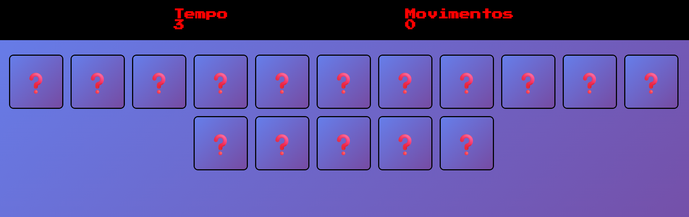
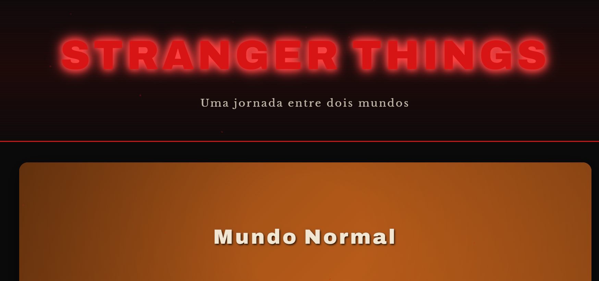
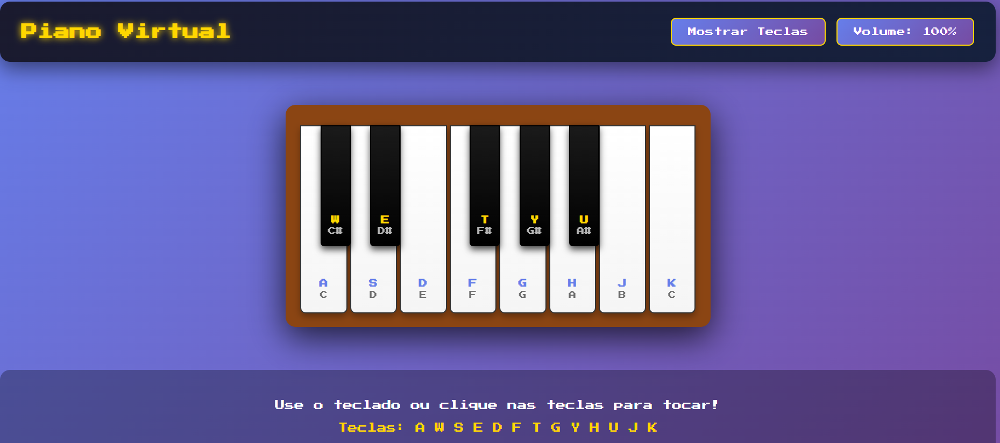
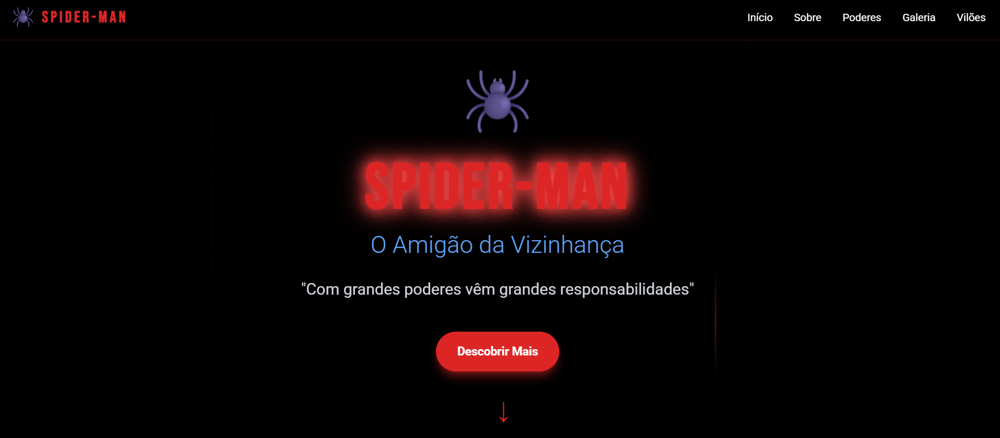

# Ri-Happy - Front-end do Zero

Bootcamp DIO - Projetos de desenvolvimento Front-end

## 📋 Sobre o Bootcamp

Este repositório contém todos os projetos desenvolvidos durante o Bootcamp **Ri-Happy - Front-end do Zero** da Digital Innovation One (DIO). Cada projeto foi criado com o objetivo de praticar e aprimorar habilidades essenciais de desenvolvimento front-end, utilizando HTML5, CSS3 e JavaScript.

## 🏗️ Padrão de Estrutura dos Projetos

Todos os projetos seguem uma estrutura organizada e padronizada para facilitar a manutenção e compreensão do código:

```
projeto/
├── index.html              # Arquivo HTML principal
├── src/
│   ├── scripts/
│   │   └── main.js        # Lógica JavaScript
│   │   └── engine.js      # (quando aplicável) Engine do jogo
│   ├── styles/
│   │   ├── reset.css      # Reset CSS e estilos base
│   │   └── main.css       # Estilos customizados
│   ├── images/            # (quando aplicável) Imagens do projeto
│   └── audios/            # (quando aplicável) Áudios do projeto
└── README.md              # Documentação do projeto
```

### 🎯 Características Comuns

Todos os projetos implementam:

- ✅ **HTML5 Semântico** - Estrutura bem definida e acessível
- ✅ **CSS3 Moderno** - Animações, transições e layouts responsivos
- ✅ **JavaScript Vanilla** - Código limpo e bem estruturado
- ✅ **Design Responsivo** - Adaptável a diferentes dispositivos
- ✅ **Boas Práticas** - Código organizado seguindo padrões de mercado
- ✅ **Nomenclatura Descritiva** - Funções e variáveis com nomes claros
- ✅ **Separação de Responsabilidades** - HTML, CSS e JS bem divididos

## 🎮 Projetos Desenvolvidos

### 1. Detona Ralph

Um jogo interativo inspirado no filme "Detona Ralph". O jogador precisa clicar no Ralph quando ele aparece nas janelas para marcar pontos antes do tempo acabar.

**Tecnologias:** HTML5, CSS3, JavaScript
**Destaques:** Sistema de pontuação, timer, efeitos sonoros, tela de game over


---

### 2. Jogo da Memória

Jogo clássico de memória onde o jogador precisa encontrar os pares de cartas iguais. Teste sua memória e concentração!

**Tecnologias:** HTML5, CSS3, JavaScript
**Destaques:** Animações de flip, sistema de tentativas, embaralhamento aleatório



---

### 3. Mundo Invertido (Stranger Things)

Landing page temática inspirada na série Stranger Things, com tema alternável entre o mundo normal e o mundo invertido.

**Tecnologias:** HTML5, CSS3, JavaScript
**Destaques:** Alternância de temas, animações, design dark/light mode



---

### 4. Piano Virtual

Um piano virtual interativo que pode ser tocado tanto pelo mouse quanto pelo teclado do computador.

**Tecnologias:** HTML5, CSS3, JavaScript, Web Audio API
**Destaques:** Sons reais de piano, controle de volume, teclas de atalho



---

### 5. Spider-Man (Homem-Aranha)

Site completo e interativo dedicado ao Homem-Aranha, com informações sobre o herói, seus poderes, vilões e galeria do multiverso.

**Tecnologias:** HTML5, CSS3, JavaScript, TailwindCSS
**Destaques:** Animações de teia, scroll effects, parallax, galeria de vilões, design moderno



---

## 🚀 Como Executar os Projetos

Cada projeto pode ser executado de forma independente:

1. Clone o repositório:
```bash
git clone https://github.com/seu-usuario/Ri-Happy-Front-end-do-Zero.git
```

2. Navegue até a pasta do projeto desejado:
```bash
cd Ri-Happy-Front-end-do-Zero/nome-do-projeto
```

3. Abra o arquivo `index.html` no seu navegador preferido

**Ou simplesmente:** Clique duas vezes no arquivo `index.html` de qualquer projeto!

## 💻 Tecnologias Utilizadas

<div align="center">


</div>

## 📚 Aprendizados

Durante o desenvolvimento destes projetos, foram praticados conceitos como:

- 🎨 **Estilização Avançada** - Flexbox, Grid, Animações CSS
- 🎮 **Lógica de Programação** - Algoritmos, estruturas de dados
- 🎯 **Manipulação do DOM** - Seletores, eventos, criação de elementos
- 🔊 **Web APIs** - Audio API, Intersection Observer
- 📱 **Responsividade** - Media queries, design mobile-first
- ⚡ **Performance** - Debounce, lazy loading, otimizações
- 🎭 **Animações** - Keyframes, transitions, transforms
- 🧩 **Componentização** - Organização e reutilização de código

## 👨‍💻 Autor

Desenvolvido com 💜 durante o Bootcamp Ri-Happy - Front-end do Zero da [Digital Innovation One](https://www.dio.me/)

## 📝 Licença

Este projeto está sob a licença MIT. Veja o arquivo LICENSE para mais detalhes.

---

<div align="center">

**🎮 Feito com dedicação e muito código! 🚀**

⭐ Se você gostou dos projetos, não esqueça de dar uma estrela no repositório!

</div>
